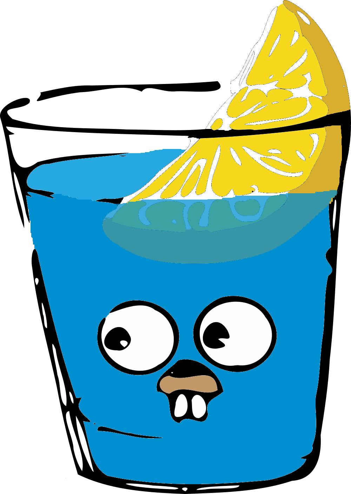
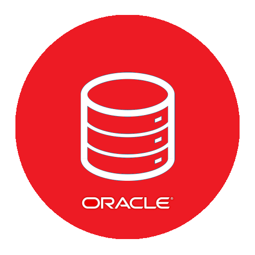
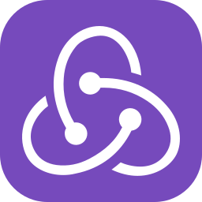

## FullStack Developer

Hi I'm Leandro.

- 🌍  I'm based in Chile
- 🖥️  See my portfolio at [Portfolio](https://leandro-marcelo.github.io/portfolio/)
- ✉️  You can contact me at [lmarcelos2019@gmail.com](mailto:lmarcelos2019@gmail.com)
- 🚀  I'm currently working on Mercado Libre

# Backend Developer Skills

## Programming Languages

| Golang                                    | TypeScript                                    | JavaScript                                    | NodeJS                                         | Bash                                         |
| ----------------------------------------- | --------------------------------------------- | --------------------------------------------- | ---------------------------------------------- | -------------------------------------------- |
|  |  |  |  |  |

## Frameworks

| Express                                           | Nest                                           | Gin                                    | Fiber                                    |
| ------------------------------------------------- | ---------------------------------------------- | -------------------------------------- | ---------------------------------------- |
|  |  |  |  |

## Cloud Computing

| Amazon Web Services (AWS)                   | Google Cloud Platform (GCP)                 |
| ------------------------------------------- | ------------------------------------------- |
|  |  |

## Databases

| Oracle                                           | MySQL                                         | PostgreSQL                                         | MongoDB (NoSQL)                            | Redis (NoSQL)                                 |
| ------------------------------------------------ | --------------------------------------------- | -------------------------------------------------- | ------------------------------------------ | --------------------------------------------- |
|  |  |  |  |  |

## ORMS

| Prisma                                    | GORM                                    | Hibernate                                         |
| ----------------------------------------- | --------------------------------------- | ------------------------------------------------- |
|  |  |  |

## Tools

| Kubernetes                                    | Docker                                    | NGINX                                    | Git                                    | Github                                         |
| --------------------------------------------- | ----------------------------------------- | ---------------------------------------- | -------------------------------------- | ---------------------------------------------- |
|  |  |  |  |  |

# Frontend Developer Skills

| REACT                                         | NEXT                                           | REDUX                                    | TAILWIND                                            |
| --------------------------------------------- | ---------------------------------------------- | ---------------------------------------- | --------------------------------------------------- |
|  |  |  |  |

[//]: <> (figma,html,css,bootstrap,sass,angular,tailwind,styledcomponents,materialui,react,nextjs,redux)
